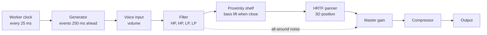

# How Hush works

This guide explains the audio engine inside `index.html`: how sounds are scheduled, how each one is synthesized, how they are placed in 3D, and how to add a new one. It assumes some familiarity with JavaScript and basic signal processing (filters, spectra, envelopes).

## Contents

1. [The Web Audio model](#1-the-web-audio-model)
2. [Code map](#2-code-map)
3. [Signal chain](#3-signal-chain)
4. [Timing: the look-ahead scheduler](#4-timing-the-look-ahead-scheduler)
5. [Building blocks](#5-building-blocks)
6. [The generators](#6-the-generators)
7. [Per-source filter](#7-per-source-filter)
8. [Register pattern](#8-register-pattern)
9. [Spatial audio](#9-spatial-audio)
10. [Master bus and lifecycle](#10-master-bus-and-lifecycle)
11. [Layout and navigation](#11-layout-and-navigation)
12. [The head map](#12-the-head-map)
13. [Adding a new sound](#13-adding-a-new-sound)
14. [Tuning and troubleshooting](#14-tuning-and-troubleshooting)

## 1. The Web Audio model

Hush uses the browser's Web Audio API. Instead of computing samples in a JavaScript loop, you build a graph of nodes (buffer sources, biquad filters, gains, panners, oscillators) and connect them. The browser renders that graph on a dedicated real-time audio thread.

JavaScript has two jobs only: build and rewire the graph, and schedule parameter changes at precise times on the audio clock (`ctx.currentTime`, in seconds). Every `AudioParam` (a gain, a filter frequency, a panner coordinate) accepts automation such as `setValueAtTime`, `linearRampToValueAtTime`, `exponentialRampToValueAtTime` and `setTargetAtTime`. These are executed sample-accurately by the audio thread, no matter how busy the page is.

That split is what keeps the app smooth: all the "musical" decisions are made in JS slightly ahead of time, and all the actual sound happens on the audio thread.

## 2. Code map

Everything lives in the `<script>` block at the bottom of `index.html`, in five sections.

**Helpers and buffers.** Globals (`ctx`, `master`, `WHITE`, `BROWN`), small helpers (`rand`, `pick`, `expRand`, `bq` for filters, `gn` for gains), the noise generators `makeNoise` and `colorNoise`, and the event helpers `loop` and `burst`.

**Sound generators (`GEN`).** One object per sound, keyed by id: `rain`, `tap`, `brush`, `fire`, `noise`, `whisper`. Each has `build(v)` to create persistent nodes, `schedule(v, t1)` to create timed events up to time `t1`, and optionally `update(v, key)` to react to a slider change while playing. Constant tables sit just above: `MATERIALS`, `VOWELS`, `CONS`.

**Sources (`DEFS`, `Voice`, `tick`, `initAudio`).** `DEFS` describes each source for the UI: name, colour, description, default parameters and extra controls. `Voice` is one playing source: its parameters `p`, its spatial path `pos(t)`, and `start`, `stop`, `schedulePos`. `tick` is the scheduler loop; `initAudio` creates the context, master bus, buffers and clock.

**UI.** `rangeCtrl` and `selectCtrl` build controls bound to `v.p[key]`. The loop over `voices` builds one panel per source. The play button handles start, pause and resume.

**Head map.** `draw()` renders the top-down view on a canvas every animation frame.

## 3. Signal chain



Every voice owns the chain from its input gain (`v.inp`) through its filter to its panner. The generator connects its nodes into `v.inp`. All voices meet at the master gain.

## 4. Timing: the look-ahead scheduler

JavaScript timers are imprecise (jitter of tens of milliseconds) and are throttled in background tabs, so they can't be used to trigger sounds directly. Hush uses the standard two-clock pattern.

A Web Worker, created from an inline Blob, posts a message every 25 ms. Workers are throttled far less than page timers, so playback survives a hidden tab. The clock is stopped when you pause and restarted when you resume (`makeClock()` returns an object with `run(on)`). On each message, `tick()` runs:

```js
const now = ctx.currentTime, t1 = now + 0.25;
for (const v of voices) {
  if (!v.active) continue;
  if (v.next < now - 0.3) v.next = now + 0.02;   // recover after a stall
  if (v.posT < now - 0.3) v.posT = now;
  GEN[v.def.id].schedule(v, t1);
  v.schedulePos(t1);
}
```

Each voice keeps a cursor `v.next`, the audio-clock time of its next event. A generator's `schedule` is always the same shape:

```js
while (v.next < t1) {
  // create an event that starts exactly at v.next
  v.next += /* time until the following event */;
}
```

Because events are placed on the audio clock, it doesn't matter if `tick` runs a few milliseconds late: the sound still starts at the right sample. The 250 ms window is a trade-off. Longer windows survive bigger stalls, but slider changes take longer to be heard.

The recovery lines handle the case where the page was frozen long enough that `next` fell into the past. Without them, the generator would try to catch up by creating all the missed events at once.

## 5. Building blocks

### Noise buffers

At start-up `makeNoise` fills two 4 s mono buffers. `WHITE` holds uniform random samples in [−1, 1]. `BROWN` is a leaky random walk:

```
y ← (y + 0.02·w) / 1.02
```

This integrates white noise, giving a −6 dB/octave spectrum, and the leak (division by 1.02) keeps it from drifting away.

### Loops

`loop(v, buf)` starts a looping buffer source at a random offset and registers it in `v.loops` so it can be stopped later. Continuous textures (rain bed, brush, fire rumble, whisper excitation) are loops.

### Bursts

`burst(t, dur, peak, dest, {attack, tail, cleanup})` is the workhorse for short events. It creates a one-shot noise source and an envelope gain:

```
gain: 0 at t → peak at t + attack (linear) → 0.0001 at t + dur (exponential)
```

It connects `source → envelope → dest`, starts the source at `t` and stops it at `t + dur + tail`. The `tail` lets resonant filters downstream keep ringing after the excitation ends. When the source ends, `onended` disconnects the source, the envelope and every node listed in `cleanup`.

Each event is therefore a small disposable sub-graph that removes itself. Generators typically create a filter, connect it to the voice, and pass it as both `dest` and `cleanup`.

### Pre-rendered variant banks

Drops, crackles and taps happen many times per second. Building filters for every one of them is wasteful, so they are rendered once, the first time a sound is switched on. Each sound that needs this has an entry in the `BAKE` table, and `ensureBank(id)` runs it once and caches the result in `BANKS[id]`; `Voice.start()` awaits it before building the voice. `bakeBank(n, slot, build)` schedules n variants in one `OfflineAudioContext`, renders it in a single pass, and slices the result into n short `AudioBuffer`s. Hush keeps, for example, 48 raindrops, 48 crackles and 16 taps per surface, each with its own random filter settings and noise. Offline variants can also use oscillators: the `tone()` helper renders a sine (or other waveform) with an optional exponential glide, vibrato, second harmonic and hold, which the water, animal and ice sounds use.

Playing an event is then `oneShot(v, buffer, t, gain, rate)`: one buffer source and one gain. Randomness is preserved in three ways: a random variant is picked, the gain is drawn from the same distribution as before, and `playbackRate` shifts the pitch (and length) slightly. In an offline benchmark at the heaviest slider settings this cut the number of nodes by 38% and the processing time by about 3.6×. The cost is a short preparation delay, typically well under half a second, the first time each sound is switched on.

### Poisson timing

Many natural sounds (rain, crackles) are well modelled as independent events at a constant average rate λ. The gaps between such events are exponentially distributed, which `expRand` samples by inverse transform:

```
Δt = −ln(1 − U) / λ,   U ~ Uniform(0, 1)
```

Regularly spaced events sound mechanical; Poisson-spaced events sound natural.

## 6. The generators

### Rain

The bed is looped white noise through a broad bandpass (1.1 kHz, Q 0.5) and a −6 dB high-shelf above 3 kHz, at gain 0.12.

Drops arrive as a Poisson process with rate λ equal to the "Drops per second" slider. Each baked drop variant is a burst of 15–50 ms through a bandpass with random centre between 1.8 and 7.3 kHz and Q between 3 and 9. When played, a drop gets a gain of `0.02 + 0.4·U²` and a playback rate between 0.85 and 1.15. Squaring a uniform variable skews it towards small values, so most drops are quiet and a few are close and loud.

### Tapping

Tapping uses modal synthesis. A struck object vibrates as a sum of damped modes, and a high-Q bandpass filter driven by an impulse behaves like one damped oscillator. Each baked tap variant is a 3 ms noise impulse feeding three bandpass filters in parallel, each followed by its own gain.

| Surface | Mode frequencies (Hz) | Q | Mode gains | Tail (s) |
|---|---|---|---|---|
| Wood | 680, 1720, 2950 | 18, 22, 25 | 9, 6, 4 | 0.15 |
| Plastic | 1300, 3100, 5200 | 25, 30, 30 | 8, 5, 3 | 0.15 |
| Glass | 2300, 5900, 9800 | 120, 140, 150 | 14, 8, 5 | 0.6 |

The decay time of a resonator is roughly τ ≈ Q / (π·f). Wood modes therefore die within about 10 ms (a dull knock), while glass modes ring for tens of milliseconds (a clear "tink"). The ratio between mode frequencies sets the character of the material. The gains compensate for the fact that a narrow filter passes little energy.

When played, every tap gets a playback rate of 1 ± 3%, which detunes all three modes together, so no two taps are identical. Timing is a two-state process: with probability 0.78 the next tap follows within 70–190 ms, otherwise there is a pause of 0.35–1.25 s. The "Rhythm" slider divides both. This produces the clustered patterns of real finger tapping.

### Brushing

One continuous noise loop runs through a bandpass (Q 0.9), a highpass at 700 Hz and a stroke gain that is normally at zero.

Each stroke lasts 0.3–0.7 s (scaled by the "Stroke speed" slider) and shapes the stroke gain as a piecewise-linear envelope: a rise over the first 15%, a slow decline to 70% of the peak, and a fall to zero. During the stroke the bandpass centre sweeps linearly from 2.2 to 4.8 kHz or from 4.8 to 2.2 kHz, chosen at random. That spectral sweep is what the ear interprets as the brush moving in a direction. Strokes are separated by short random gaps.

### Fire

The rumble is looped brown noise through a lowpass at 380 Hz, at gain 0.45.

Crackles are Poisson events at the "Crackles per second" rate. Each baked variant is a burst of 1.5–7.5 ms through a highpass with random cutoff between 1.2 and 4.2 kHz. When played, a crackle gets a gain of `0.05 + 0.9·U³` and a playback rate between 0.9 and 1.1. This is a heavy-tailed distribution in which occasional loud pops stand out from many small ticks. With probability 0.2 an event becomes a cluster of 3–6 crackles within about 60 ms, the way wood actually splits.

### Noise colours

`colorNoise(color)` generates an 8 s stereo buffer sample by sample, with independent random numbers for each channel, and caches it.

| Colour | Slope | Construction |
|---|---|---|
| White | flat | Uniform random samples |
| Pink | −3 dB/oct | Paul Kellet's filter: seven one-pole filters with staggered time constants whose sum approximates 1/f |
| Brown | −6 dB/oct | Leaky random walk |
| Blue | +3 dB/oct | First difference of pink noise |
| Violet | +6 dB/oct | First difference of white noise |
| Grey | perceptually flat | Pink noise, then +8 dB low-shelf at 200 Hz and −7 dB peaking cut at 3 kHz |

The differencing trick works because the filter `y[n] = x[n] − x[n−1]` has power response

```
|1 − e^(−iω)|² = 4·sin²(ω/2) ≈ ω²   for small ω
```

which is a +6 dB/octave tilt. Applied to white noise (flat) it gives violet; applied to pink (−3) it gives blue (+3). Grey is an approximate inverse of the ear's equal-loudness curve, so it sounds equally loud across the spectrum rather than measuring flat.

Two post-processing steps make the loops usable. First, the loop point is seamless. The buffer is generated 0.5 s too long, and the extra tail is crossfaded into the beginning with equal-power gains √a and √(1−a). Equal power is correct here because the two overlapping segments are uncorrelated, so their powers add. After the crossfade, the last sample of the buffer flows continuously into the first, which matters most for brown noise, where a jump would be an audible click. Second, the level is normalized. The mean is removed and every buffer is scaled to an RMS of 0.18, so switching colour doesn't cause large jumps in level. Brown still sounds quieter than white because the ear is less sensitive at low frequencies.

The noise voice adds three controls on top:

- **Tone** is a lowpass whose cutoff is `500·32^x` Hz for slider position x in [0, 1]. The exponential mapping makes the slider feel even, since pitch perception is logarithmic.
- **Waves** is a 0.07 Hz sine `OscillatorNode` connected directly to the `gain` param of a gain node. The param's own value is set to `1 − 0.45·d` and the oscillator's amplitude to `0.45·d`, where d is the slider. The result is amplitude modulation with a period of about 14 s that never exceeds unity.
- **Colour** changes while playing start a new buffer source with its own gain fading in, while the old one fades out and is removed a moment later.

### Water drops

Each variant is an impact click (2 ms burst above 2.5 kHz) followed 4 ms later by a sine whose pitch rises by a factor of 1.5 to 2.3 over 50–110 ms, starting between 450 and 1550 Hz. This is the Minnaert resonance of the air bubble the drop traps: a bubble of radius a rings at roughly f ≈ 3.26 m/a Hz, and its pitch rises as it approaches the surface. Drops arrive as a Poisson process, and a quarter of them get a second drip shortly after. The "Drop size" slider divides the playback rate, so bigger drops ring lower and longer, as larger bubbles do.

### Squishy

A continuous noise loop runs through a bandpass (Q 1.5), a 2.5 kHz lowpass and a squeeze envelope. Each squeeze lasts 0.45–1.15 s, rises over its first 30%, and sweeps the bandpass between 350 Hz and 1 kHz. During the squeeze, small bubble pops (baked sines gliding upwards over 15–55 ms) and sticky micro-click clusters are scattered with a density weighted by sin(πu), so most of them fall in the middle of the squeeze. "Stickiness" sets how many there are and "Bubble size" sets their pitch.

### Crinkles and cracks

This source has three materials:

- **Crinkly wrapper:** each crumple gesture (0.25–1.15 s) is a dense Poisson cloud of 1–4 ms clicks through random highpass or bandpass filters. The click rate and loudness follow an envelope over the gesture, and the loudness is heavy-tailed (U³), which is what makes plastic sound crisp and irregular.
- **Cracking ice:** a sharp crack, a low thump (140→55 Hz) and a descending "pew" chirp from 2.5–5 kHz down to a few hundred hertz, sometimes with a second, weaker one. The chirp comes from dispersion: bending (flexural) waves in an ice sheet travel faster at high frequency, so a distant crack arrives with its high frequencies first.
- **Snapping twigs:** a broadband snap exciting three short woody resonances (about 850, 2100 and 3500 Hz, detuned per variant), followed 12–62 ms later by a smaller second break; sometimes another snap follows a moment later.

### Cat purring

A purr is a train of pulses at about 25 Hz (adjustable 20–32 Hz), produced as the cat's laryngeal muscles open and close the glottis. Each pulse is a baked 35 ms low-passed noise puff plus a short low tone gliding down to 60 Hz. The pulses are grouped into alternating exhale and inhale phases: exhales last 1.1–1.5 s and are louder, inhales last 0.8–1.1 s, are quieter and slightly faster (×1.08). Within each phase the pulse level follows sin^0.6, and a soft band-passed breath noise rises and falls with the phase.

### Crickets

Each chirp is 3–4 pulses of a nearly pure tone around 4.2–4.9 kHz (18 ms each, 35 ms apart). Several crickets (1–4) chirp independently, each with its own pitch variant, level and slightly different rhythm. The chirp rate follows Dolbear's law for the snowy tree cricket, N = 4·(T − 50) + 40 chirps per minute with T in °F, so the "Temperature" slider sets the rate: about 40/min at 10 °C, 126/min at 22 °C and 198/min at 32 °C.

### Birds

The bird has a motif of 3–6 elements, each an up-sweep (2.2–3 kHz rising to 4.5–6 kHz), a down-sweep, a held whistle with fast vibrato, or a trill of 6–12 short notes around 4–5 kHz. All are baked sines with a small second harmonic. Each phrase replays the motif, sometimes shortened by one or two elements and transposed slightly with the playback rate. With a 15% chance per phrase the motif is replaced by a new one, like a different bird or song. Phrases are separated by 1.5–5.5 s, divided by the "Singing" slider.

### Frogs

A croak ("rib-bit") is a sawtooth at 180–320 Hz, gated by a fast pulse train (28–44 Hz, 5–11 pulses per part, one or two parts) and filtered through a bandpass at 700–1200 Hz standing in for the throat and vocal sac. The pitch drops slightly over the croak. Croaks are Poisson events, each played at a random rate between 0.8 and 1.25 so they sound like different frogs, and 30% of them get an answer from another frog shortly after.

### Instruments: shared key and scale

All instruments read one global key (`MUSIC.root`, a pitch class) and scale (`MUSIC.scale`): major or minor pentatonic, major, natural minor or Dorian. The **Key** and **Scale** selectors at the top of the Instruments section set them, and every instrument that holds sustained notes (the sung bowl and the pad) glides to the new tuning. `scaleMidi(base, deg)` turns a scale degree into a MIDI note: degree 0 is the tonic above the C given as `base`, and degrees beyond the scale's length wrap into higher or lower octaves. Frequencies use equal temperament, f = 440·2^((m − 69)/12). With D major pentatonic, degrees 0 to 5 above C4 give D4, E4, F♯4, A4, B4, D5.

Struck instruments use `modalStrike(v, t, f, modes, amp, decay)`, which plays live sine oscillators, one per mode, each with an exponential decay and stopped after five time constants (about −43 dB). A mode can be split into two partials a few tenths of a hertz to a few hertz apart, which produces beating. Each mode is written as [frequency ratio, amplitude, decay time, beat].

### Singing bowl

A bowl's modes are not harmonic; typical ratios are about 1 : 2.71 : 5.15 : 8.43. Because a real bowl is never perfectly symmetric, each mode is really two nearly equal vibrations whose frequencies differ slightly, and their sum beats slowly, the characteristic "wah-wah" of a bowl. Hush gives the first three modes beats of about 0.3–1.2 Hz, 1–2.5 Hz and 1.5–4 Hz, and decay times of 12, 6, 3 and 1.5 s (scaled by "Ring time"), so the sound starts bright and settles into the fundamental. A short band-passed noise burst adds the mallet contact. The fundamental is the key's tonic in octave 3, 4 or 5 for a large, medium or small bowl.

In **Sung** mode the bowl is played like rubbing its rim: the two lowest modes, each as a beating pair, sound continuously, their level swells slowly (a 0.06–0.1 Hz oscillator), and a faint narrow band of noise at the second mode stands in for the friction.

### Kalimba

Each note is a steel tine: the fundamental decays with τ ≈ 0.9·(523/f)^0.3 s, so low notes ring longer, and an overtone at 6.27 times the fundamental dies within about 0.3 s. That ratio is the second mode of a bar clamped at one end, which gives the kalimba its bell-like attack. A very short burst adds the thumb's contact. The melody is a random walk over two octaves of the scale, mostly by steps of one or two degrees, bouncing off the ends. Note lengths are drawn from half, one, one and a half and two beats at the chosen tempo, with ±10 ms of human timing, and phrases of 6–12 notes are separated by rests. "Two-note chords" is the probability of also playing the note two scale degrees higher, as when a thumb catches two tines.

### Harp

The harp uses the Karplus–Strong algorithm, computed directly into buffers when the harp is first switched on. A delay of N samples is filled with softened noise (the pluck), and then

```
y[n] = ρ · (y[n − N] + y[n − N − 1]) / 2
```

The average of two neighbouring samples is a gentle lowpass, so high harmonics die first, as on a real string. Because of that averaging, the loop period is N + ½ samples, and the true pitch of each rendered note is f = f_s/(N + ½); the bank stores this exact pitch, so the small error from using a whole number of samples is corrected at playback. The loss factor is ρ = exp(−1/(f·τ)) with τ = 2.2·√(220/f) s (clamped to 0.6–4 s), giving longer decays for lower strings.

Twelve notes, four semitones apart from G♯2 to E6, are rendered, and each played note uses the nearest one with a playback-rate shift of at most two semitones. A check on the rendered buffers measured their pitch within 0.5 cents of the stored value. The harp plays rolled chords built from the scale (degrees i, i+2, i+4 and the octave above the first two), upwards, downwards or both, with 100–160 ms between strings.

### Wind chimes

Six tubes are tuned to the first six scale degrees, starting at C5 or C4 plus the key. A hanging tube vibrates like a free-free bar, with modes at about 1 : 2.76 : 5.40, decaying over 1.8, 0.9 and 0.4 s (scaled by "Ring time"). Strikes are a Poisson process whose rate is 0.15 + 5 · wind · gust(t) per second, where the gust strength is a product of slow sines (periods of 17 and 7.3 s, plus a faster 3.1 s ripple) clipped to [0, 1]. Most strikes hit a tube near the previous one, since the clapper swings, and 30% hit a random tube.

### Warm pad

Four chord tones sound continuously: the chord root an octave down, the root, and the notes two and four scale degrees above it. Each tone is two sawtooth oscillators detuned by ±7 cents, one sent to each ear through a `ChannelMergerNode`, which makes the sound wide in "All around" mode. The mix goes through a lowpass whose cutoff ("Brightness", 250 Hz to 3 kHz) drifts by half an octave with a 0.05 Hz oscillator, and a slow 0.07 Hz swell. At random intervals set by "Chord changes per minute", a new chord root is chosen from the scale and every oscillator glides to its new pitch with a 1.2 s time constant, so the chords melt into each other.

### Mouth sounds

This source has three baked sound types:

- **Tongue clicks:** a 2 ms impulse into two resonances (1.1–2.7 kHz and 1.9 times that), standing in for the mouth cavity.
- **Lip smacks:** 30–50 ms of noise through a bandpass that falls from about 2.5 kHz to 500–900 Hz as the lips part.
- **Wet sounds:** clusters of 4–10 sub-millisecond clicks above 2 kHz within 50 ms.

Events come in groups of 2–6, 70–270 ms apart, with longer pauses between groups. The "Style" control changes the mix, and "Wetness" is the probability that a click or smack is followed by a wet cluster, which also makes those clusters louder. The default position is 18 cm away, sweeping from ear to ear.

### Whispering

Speech can be described by the source-filter model. A source (the glottis) produces an excitation, and the vocal tract filters it. The resonances of the tract are the formants, conventionally F1, F2 and F3, and their positions determine which vowel we hear. In voiced speech the source is a periodic pulse train. In a whisper the vocal folds don't vibrate and the source is turbulent noise. So a whisper is, to a good approximation, noise through formant filters.

**Vowel path.** One looped noise source feeds three parallel bandpass filters, one per formant, plus a broad 1.1 kHz "air" layer. They are summed into a vowel gain `v.vg`, then darkened by a 3.6 kHz lowpass and a −5 dB high-shelf.

| Vowel | F1 | F2 | F3 |
|---|---|---|---|
| /a/ | 800 | 1200 | 2600 |
| /e/ | 550 | 1900 | 2600 |
| /i/ | 320 | 2400 | 3100 |
| /o/ | 600 | 900 | 2500 |
| /u/ | 350 | 850 | 2300 |

Values are in hertz, slightly raised compared with voiced speech, as is typical for whispers. The filters use low Q (3.5, 4.5, 5). Narrow formant filters on noise produce a whistling tone, which is exactly what makes a synthetic whisper sound harsh.

**Consonants** don't use the formant bank. They are separate bursts, each through its own permanent bandpass filter (created once in `build`), then a softening lowpass at 6 kHz:

| Consonant | Implementation |
|---|---|
| s | 100–180 ms burst, bandpass 5 kHz, Q 1.2, soft attack |
| sh | same, bandpass 2.4 kHz |
| f | same, broad bandpass 3.5 kHz |
| t, k | 40 ms burst with 8 ms attack, bandpass 3.2 kHz or 1.6 kHz, very quiet |
| h | no burst; the following vowel fades in more slowly |

**A syllable** is an optional consonant followed by a vowel. For the vowel, the three formant frequencies glide towards the new targets with `setTargetAtTime` (a first-order exponential approach with a 30 ms time constant, which mimics articulators moving). The vowel gain rises towards a random level with a 35 ms time constant (70 ms after "h") and decays with a 60 ms time constant near the end. The vowel lasts 160–320 ms, divided by the "Pace" slider.

**Prosody** comes from a small state machine above the syllables: 1–3 syllables form a word, words are separated by 250–650 ms pauses, and 3–5 words form a phrase. Every phrase starts with a breath, a 1.1 s swell of noise around 1.2 kHz with a slow attack, followed by a pause of 1.6–3 s.

The "Voice size" slider multiplies all formant frequencies. A longer vocal tract has lower resonances, so values below 1 sound like a larger person.

The result is deliberately unintelligible, a style known in ASMR as inaudible whispering. Real words need a different approach; see the README for ideas.

## 7. Per-source filter

Every source has a collapsible **Filter** section with a high-pass and a low-pass, like the analogue filters in electronics, plus a slope and a resonance control. Using both at once gives a band-pass. A plot shows the combined magnitude response (a Bode magnitude plot, 20 Hz to 20 kHz, +24 to −48 dB) and updates as you move the sliders.

### Chain

Each voice has four `BiquadFilterNode`s in series, right after its input gain: high-pass, high-pass, low-pass, low-pass. A biquad is a second-order (2-pole) filter, so one stage rolls off at 12 dB/octave, the same as two cascaded RC sections. Two stages in series give 24 dB/octave.

| Control | Range | Mapping |
|---|---|---|
| High-pass | off, 20 Hz to 8 kHz | f = 20·400^x |
| Low-pass | 200 Hz to 20 kHz, off | f = 200·100^x |
| Slope | 12 or 24 dB/oct | one or two active stages |
| Resonance | none to about +21 dB | adds to the Q of the last active stage |

The cutoff sliders are logarithmic, because pitch perception is logarithmic.

### Pole placement

With 12 dB/octave the active stage uses Q = 1/√2 ≈ 0.7071, the Butterworth value, so the response is maximally flat and −3 dB at the cutoff. With 24 dB/octave the two stages use Q = 0.5412 and 1.3066. These are the pole pairs of a 4th-order Butterworth filter, so the cascade is also maximally flat and −3 dB at the cutoff. Using 0.7071 twice would instead give −6 dB at the cutoff and a softer knee.

Resonance adds up to 11 to the Q of the last stage, which creates a peak near the cutoff, the way a resonant analogue synthesizer filter does. For a 2-pole stage the peak is roughly 20·log₁₀(Q) dB.

Web Audio specifies the `Q` of `lowpass` and `highpass` biquads in decibels, not as a linear quality factor. The code keeps linear Q values in its maths and converts with `20·log₁₀(Q)` when setting the parameter.

### Bypassed stages

A stage that isn't needed is made transparent instead of being disconnected, so switching slope or turning a filter off never rewires the graph (rewiring can click). A high-pass at 0 Hz and a low-pass at the Nyquist frequency both reduce to an identity filter in the Web Audio implementations. Changes are applied with `setTargetAtTime` (30 ms time constant) to avoid zipper noise.

Checked numerically: with both filters off the response is 0.0 dB everywhere. A 1 kHz low-pass gives −3.0 dB at 1 kHz in both modes, and about −12 dB (12 dB/oct) or −24 dB (24 dB/oct) at 2 kHz.

### Where it lives in the code

`filterSettings(p, nyquist)` turns the four slider values into frequency and Q for each stage. `applyFilter(v)` sends them to the voice's nodes. `drawBode(v)` computes the plot with `getFrequencyResponse` on four identical filters in a tiny `OfflineAudioContext`, so the plot works before audio has started. `filterChanged(v)` is called by any filter control and does both.

## 8. Register pattern

The **Register pattern** panel, below the sound list, records the movement of a slider and replays it in a loop on any slider of any sound. For example, a hand-drawn left-right swing can drive the direction of the whisper, a slow wave can drive the low-pass cutoff of the rain, or a jittery scribble can drive the tapping rhythm.

### Recording

Press **Record**, then move the pattern slider. Recording starts with the first movement, so there is no dead time at the beginning, and ends when you press **Stop** (or after 60 seconds). While recording, the slider's position (0 to 1) is sampled every 20 ms (50 Hz) with a page timer, and the curve is drawn live. Takes shorter than 0.2 s are discarded.

A pattern is stored as `{id, name, values}`, with values rounded to three decimals. Saved patterns are listed with a small preview, their length and an editable name, and are kept in the browser's `localStorage` under `hush.patterns`, so they survive a reload on the same browser. If storage isn't available, patterns still work for the current session.

### Generating a pattern

Instead of recording, **Or generate one** creates a pattern from a shape. Every generator returns samples in [0, 1] that loop cleanly; the **Lowest** and **Highest** sliders then map them linearly (setting Lowest above Highest inverts the pattern). **Length** is the loop duration, 0.5 to 60 s; for periodic shapes it is the period. **Changes per second** (0.2 to 10) sets how busy a random shape is and is disabled for periodic ones.

| Shape | Kind | Construction |
|---|---|---|
| Sine | periodic | ½ − ½·cos(2πu), starting from the low point |
| Triangle | periodic | linear up and down |
| Ramp up, Ramp down | periodic | sawtooth, with a jump at the loop point |
| Square | periodic | high for half the period |
| Pulse | periodic | high for 15% of the period |
| Breathing | periodic | sin² rise over 40% of the period, slower cos² fall |
| Smooth random | random | K random knots on a circle, cosine interpolation between them |
| Random steps | random | sample and hold: K random levels |
| Random walk | random | K Gaussian steps, turned into a Brownian bridge, then normalized |
| 1/f drift | random | sum of K harmonics of the loop frequency with amplitude 1/√m and random phases, normalized |
| Ornstein–Uhlenbeck | random | mean-reverting noise around 0.5 with rate θ, bridged, clipped to [0, 1] |
| Random bursts | random | K events at random times, each jumping to a random height and decaying with τ = 150 ms |

Here u is the phase within the loop, from 0 to 1, and K is the loop length times the changes per second.

Random patterns have to loop without a jump, which each generator handles differently. Smooth random and 1/f drift are periodic by construction: the knots sit on a circle, and a Fourier series built only from harmonics of the loop frequency repeats exactly. Random walk and Ornstein–Uhlenbeck are forced to close with a Brownian-bridge correction, subtracting the straight line from the start value to the end value:

```
b_i = x_i − (x_{n−1} − x_0) · i / (n − 1)
```

This removes the end-to-end drift while keeping the local texture. Random bursts wrap their decay tails around the end of the loop. The Ornstein–Uhlenbeck process is integrated with Euler–Maruyama,

```
x ← x + θ·(0.5 − x)·Δt + σ·√Δt·N(0, 1),   σ = 0.18·√(2θ)
```

so its stationary standard deviation is 0.18 and it stays mostly inside [0, 1]. Unlike the other random shapes it is not stretched to the full range, so its amplitude reflects the process rather than the extremes of one realisation.

A check over all generators found every value finite and in range. The seam between the last and first sample is below 0.02 for all continuous shapes; only the shapes meant to jump (ramps, square, pulse, steps, bursts) have jumps.

Generated patterns are named after their shape ("Sine 1", "Random walk 2") and saved like recorded ones.

### Using a pattern

Under **Use a pattern**, in the Patterns section, choose the pattern, the sound, the setting (any of that sound's sliders, including the filter ones) and a speed from 0.25× to 4×, then press **Apply**. Each setting can be driven by one pattern at a time; applying another replaces it. The driven slider's value turns lilac, and the link appears under that sound in the Now playing section. Deleting a pattern also removes its links.

A link maps the pattern linearly onto the slider's full range:

```
value(t) = min + (max − min) · P((t − t₀) · speed / 0.02)
```

where t is the audio clock, t₀ the time the link was created, and P reads the sample array with linear interpolation, wrapping around at the end so the pattern loops. Because patterns follow the audio clock, they pause with the audio.

### Where playing patterns are shown

Each running link appears in the **Now playing** section (see section 11), under the sound it drives. Its row shows the pattern's curve in that sound's colour with a playhead, the pattern's name, the setting and its current value, a speed slider and a Remove button; **Stop all patterns** removes every link. The playheads and values are updated by the same animation loop that draws the head map, so they move while audio is playing.

Changing the speed of a playing link keeps its position in the loop: with loop position (t − t₀)·s, a new speed s′ gets a new start time t₀′ = t − (t − t₀)·s/s′, so the pattern continues from where it was instead of jumping.

### How values reach the sound

Most settings are updated at control rate. On every scheduler tick (25 ms), `applyLinks` writes the pattern value into the slider and fires its `input` event, so exactly the same code runs as when you move the slider by hand. Volume and filter changes are smoothed by their `setTargetAtTime` glides.

Position is handled more precisely. `Voice.pos(t)` reads direction and distance through `Voice.val(key, t)`, which evaluates the pattern at the exact time t when a link exists. Position ramps, which are scheduled up to 250 ms ahead, therefore follow the pattern without delay. A "Still" source whose direction or distance is driven by a pattern is treated as moving, so it gets continuous position automation.

### Motion speed without jumps

Circle, ear-to-ear and drift movements depend on a motion phase. Earlier versions used ω·t directly, so changing the speed made the sound jump, because t (the audio clock) is large. The phase is now

```
u(t) = u₀ + ω · (t − t₀)
```

and when the speed changes, `Voice.retime()` sets t₀ to the end of the already-scheduled path and u₀ to the phase there. The path stays continuous whether the speed is moved by hand or by a pattern; a pattern-driven speed becomes piecewise constant, updated every 25 ms.

## 9. Spatial audio

### HRTF panning

Each voice ends in a `PannerNode` configured with `panningModel: 'HRTF'`. A head-related transfer function is a measured pair of filters, one per ear, that encodes how sound from a given direction reaches each eardrum. It captures the difference in arrival time between the ears, the level difference caused by the head's shadow, and the direction-dependent colouring from the outer ear. Filtering a mono signal with the HRTF for a direction makes the brain place it there. This only works with headphones, because loudspeakers mix the two channels in the air.

### Coordinates and movement

The listener sits at the origin facing −z, with +x to the right. For a polar angle θ (0 in front, +90° to the right) and distance d:

```
x = d·sin θ
z = −d·cos θ
```

`Voice.pos(t)` returns the position at audio time t for the selected movement, where θ₀ is the "Direction" slider and u is the motion phase, which advances at the "Movement speed" ω in radians per second (see section 8):

| Movement | Path |
|---|---|
| Still | θ = θ₀ |
| Circle around me | θ = θ₀ + u |
| Ear to ear | θ = (π/2)·sin(u/2 + φ), a pendulum from ear to ear through the front |
| Drift | θ = θ₀ + sin(0.37u + φ) + 0.6·sin(0.91u), and d scaled by 1 + 0.35·sin(0.53u + 2φ) |

φ is a random phase per voice so that two drifting sources don't move in sync. In the drift mode the frequency ratios are incommensurate, so the path is smooth but never exactly repeats. Distance is clamped to at least 12 cm.

### Scheduling movement

For moving sources, `schedulePos(t1)` samples the path every 40 ms from the last scheduled point up to `t1`, and writes each sample as a `linearRampToValueAtTime` on the panner's `positionX` and `positionZ`. The audio thread interpolates between these points, so movement stays smooth even if the page stalls. Sources set to "Still" only get a new ramp when one of their sliders changes, and voices in "All around" mode get no position automation at all.

### Distance and proximity

Loudness follows the inverse-distance model:

```
gain = r_ref / (r_ref + rolloff·(d − r_ref))   for d ≥ r_ref
```

with `r_ref = 0.25 m` and rolloff 1. Below 25 cm the gain stays at 1.

On top of that, a low-shelf filter at 220 Hz boosts the bass as the source approaches:

```
shelf gain (dB) = clamp(10·(0.6 − d) / 0.45, 0, 10)
```

This is 0 dB beyond 60 cm, rising to +10 dB at 15 cm. It imitates the proximity effect of directional microphones, which ASMR creators rely on for the "right next to your ear" feeling. The shelf gain is ramped together with the position.

### All-around mode

For the noise source in "All around" mode, `Voice.start` connects the input straight to the master gain and skips the shelf and panner. The two independent channels of the stereo buffer reach the ears unchanged, and the brain hears decorrelated signals as diffuse, enveloping sound rather than a point. The panner is still created (so the scheduling code doesn't need a special case) but is left unconnected. Switching between modes restarts the voice.

## 10. Master bus and lifecycle

All voices sum into a master gain (the page's volume slider) followed by a `DynamicsCompressorNode` (threshold −18 dB, ratio 4:1, attack 5 ms, release 200 ms). Random events occasionally line up into peaks; the compressor keeps them from clipping.

**Starting a voice.** `Voice.start()` creates fresh node lists, builds the input gain, the four filter stages, shelf and panner, fades the input gain up to the voice volume, sets the initial position, sets `next` 100 ms into the future, and calls the generator's `build`.

**Stopping a voice.** `Voice.stop()` fades the input gain to zero with a 40 ms time constant, which avoids a click, and after 400 ms stops all loops and disconnects all nodes. The node lists are captured in local variables before the timeout, so if the user switches the source back on within those 400 ms, the teardown only affects the old graph.

**Live changes.** Volume changes use `setTargetAtTime` with a 50 ms time constant. Setting a parameter value instantly would produce "zipper noise". Other sliders simply update `v.p`; the scheduler reads the new value on its next pass, and generators with an `update` method apply changes to running nodes immediately.

**Pause and resume** use `ctx.suspend()` and `ctx.resume()`, which freeze the audio clock. The scheduler checks `ctx.state` and does nothing while suspended.

## 11. Layout and navigation

The list starts with **Now playing**, followed by the sound sections, Ambience (noise colours, rain, fire, water drops), Touch and objects (tapping, brushing, squishy, crinkles and cracks), Animals (birds, crickets, cat purring, frogs), Instruments (singing bowl, kalimba, harp, wind chimes, warm pad) and Mouth and voice (mouth sounds, whispering), and ends with Patterns. The sections come from the `GROUPS` table, and each entry in `DEFS` names its group. The Instruments section also holds the shared Key and Scale selectors.

A **Section** menu sticks to the top of the list, and only the chosen section is shown; the others are hidden with the `hidden` attribute. The page opens on Now playing. A small green dot marks every section in which something is playing (a sound switched on, or for Patterns, a pattern running), and the menu button carries the dot of the section currently shown.

The menu is a custom dropdown rather than a native `<select>`, because option elements can't reliably show a coloured dot. It follows the listbox pattern: the button has `aria-haspopup` and `aria-expanded`, the list has `role="listbox"` and its items `role="option"` with `aria-selected`. It can be used with the keyboard (arrow keys open it and move between items, Home and End jump to the ends, Enter or Space choose, Escape closes and returns focus to the button, Tab closes it), and a click outside closes it. When a section is shown, canvases inside it (filter plots, pattern curves) are redrawn, since they have no size while hidden, and if the top of the list has been scrolled away the page scrolls back to it.

**Now playing** has one block per sound that is switched on: its colour, its name (click it to switch to that sound's section and open its settings), a volume slider kept in sync with the sound's own Volume slider, and an Off button. Below the header, each pattern driving that sound is listed. **Turn everything off** switches every sound off.

Each sound card shows its name and switch (the description appears as a tooltip on the name), while its controls and filter sit in a collapsible **Settings** block that starts open only for sounds that are on.

The page was checked in headless Chromium at 360, 768 and 1280 px wide: nothing extends past the screen edge, there are no console errors, and the menu works with mouse and keyboard. The body uses `overflow-x: clip` as a safety net; `overflow-x: hidden` would turn the body into a scroll container and stop the map and the menu from sticking.

## 12. The head map

`draw()` runs on `requestAnimationFrame`, but only while audio is playing; when stopped, `requestDraw()` redraws once after each change. The canvas resolution follows its displayed size times `devicePixelRatio`, so it stays sharp on high-resolution screens. It draws distance rings at 25 cm, 50 cm, 1 m and 2.5 m, a head with a nose pointing forward (up on screen) and two ears, and one dot per active voice.

The dots are placed by calling the same `pos(t)` function the audio uses, evaluated at `ctx.currentTime`, so the map shows where the sound actually is rather than a separate animation. Distances use a square-root scale, `r_px = R·√(d / 2.5)`, which gives more room to the close range where most of the interesting movement happens. Voices in "All around" mode are drawn as a ring at the edge.

### Dragging sounds

The dots can be dragged. On `pointerdown`, `hitDot` finds the nearest dot within about 32 px (in canvas pixels, scaled with the canvas). The dragged sound is switched to "Still", and any pattern driving its direction or distance is removed, since it would fight the hand. While dragging, `placeAt` converts the pointer into the two sliders by inverting the map's projection:

```
θ = atan2(Δx, −Δy)          (0° in front, +90° to the right)
d = 2.5 · (r / R)²          (inverse of the square-root distance scale, clamped to 0.12–2.5 m)
```

where Δx and Δy are the offsets from the head, r their length and R the map radius. The values are written into the Direction and Distance sliders and their `input` events are fired, so the labels, the audio and the map update exactly as if the sliders had been moved. A numerical check of the round trip, pointer to parameters to screen position, gives errors around 10⁻¹³ px. Hovering a dot enlarges it and shows the sound's name. The canvas uses `touch-action: none`, so dragging works on touch screens; the side effect is that the page can't be scrolled by swiping on the map itself.

For a still sound, a change is now scheduled about 30 ms ahead rather than after the whole look-ahead window, so dragged sounds follow the pointer closely. When the previous position ramp already lies in the past, `anchorPos` first pins the current panner values at the present time, so the new ramp starts from where the sound actually is instead of interpolating from an old event.

## 13. Adding a new sound

New sources get the filter section, the Settings block and pattern support automatically. If a sound is short and frequent, add a `BAKE` entry under the same id that returns `bakeBank(...)` (or an object of several banks), and play the variants from `BANKS[id]` with `oneShot`, as most sounds do. The bank is baked the first time the sound is switched on.


As an example, here is a minimal "clock ticking" source.

**Step 1. Write the generator** and add it to `GEN`:

```js
clock: {
  build(v) {},                        // no continuous sound
  schedule(v, t1) {
    while (v.next < t1) {
      const f = bq('bandpass', 3000 + rand() * 200, 12);
      const g = gn(6);
      f.connect(g).connect(v.inp);
      burst(v.next, 0.004, 0.8, f, { tail: 0.05, cleanup: [f, g] });
      v.next += 60 / v.p.bpm;         // steady beat
    }
  }
},
```

**Step 2. Describe it** by adding an entry to `DEFS`:

```js
{ id: 'clock', group: 'touch', name: 'Clock', color: '#A7B8D9',
  desc: 'A small clock ticking on the table.',
  p: { on: false, vol: 0.5, mode: 'static', angle: -40, dist: 0.8, speed: 5, bpm: 60 },
  extra: [['range', 'bpm', 'Ticks per minute', 30, 120, 1, x => x]] },
```

The `id` must match the key in `GEN`, and `group` must be one of the ids in `GROUPS`; the entry's position in `DEFS` decides where it appears within its section. Every source needs the common parameters `on`, `vol`, `mode`, `angle`, `dist` and `speed`. Each item in `extra` is either `['range', key, label, min, max, step, formatter]` or `['select', key, label, options]`, where options are strings or `[value, label]` pairs.

**Step 3 (optional). React to live changes.** If a parameter controls a node that already exists (rather than being read at scheduling time), add an `update(v, key)` method to the generator, as the `noise` generator does for tone and colour.

A few rules keep new generators well behaved. Always connect into `v.inp`, never directly into `master`, so volume, fades and panning work. Register continuous sources with `loop()` and persistent nodes in `v.nodes`, so `stop()` can clean them up. For per-event nodes, pass them in `cleanup` so they are released when the event ends. Use `setTargetAtTime` or ramps for any change that could otherwise click.

## 14. Tuning and troubleshooting

**Something is too loud or too quiet.** The levels were set by reasoning about filter bandwidths rather than by ear, so some may need adjusting. The relevant constants are the gains in each `build` (bed levels), the `peak` values passed to `burst`, and the mode and formant gains in `MATERIALS` and in the whisper `build`. As a rule of thumb, white noise through a bandpass of bandwidth B keeps a fraction of roughly √(B / (fs/2)) of its amplitude, so narrow filters need large gains.

**The whisper is too hissy.** Lower the 3600 Hz lowpass cutoff in the whisper `build`, or reduce the fricative amplitudes `a` in `CONS`. If it sounds muffled, raise the cutoff.

**No sound at all.** Audio only starts after clicking the play button. Check that the tab isn't muted, and look at the browser console for errors. If the page was opened from `file://`, try serving it over `http://localhost` as described in the README.

**Clicks or dropouts.** Close other heavy tabs. Very high drop or crackle rates create many short-lived nodes; if needed, lower the maximum of those sliders. The `latencyHint: 'playback'` option already asks the browser for larger, more stable audio buffers.

**Positions sound vague.** Make sure you are wearing headphones and that the operating system isn't applying its own spatial audio processing on top, which would conflict with the browser's HRTF.
